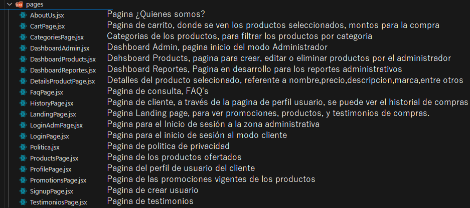

# Ecommerce Juguetitos 👩‍💻

Juguetitos es una pagina web diseñada para facilitar la compra de juguetes en un espacio virtual, donde el cliente puede ver las caracteristicas del producto y el administrador del negocio puede crear,editar o borrar productos o promociones.

<p align="center">
    
</p>

## Características ⚙️

- Registro y autenticación de usuarios.
- Creación, edición y eliminación de productos, en modo administrador.
- Listado de productos en el cart.
- Pagina de perfil de cliente, para conocer historial de compras.

## Tecnologías utilizadas ⚒️

Frontend:

- React: Para construir la interfaz de usuario.
- Vite: Como bundler y servidor de desarrollo.
- Tailwind CSS: Para estilos utilitarios.
- React Router DOM: Para el manejo de rutas.
- JSON Server: Para simular una API REST durante el desarrollo.
- ESLint y Prettier: Para asegurar la calidad y el formato del código.
- Husky y lint-staged: Para ejecutar scripts de pre-commit.

Backend:

- Node.js (Express) con TypeScript: Para desarrollar la API.
- Base de Datos: PostgreSQL para almacenar información.
- Autenticación: Registro y autenticación de usuarios.
- Carga de Imágenes: Funcionalidad para cargar imágenes.
- Envío de Correos: Integración para el envío de correos electrónicos.

Funcionalidades Avanzadas:

- Pagos, presentación de información en un mapa o funcionalidades en tiempo real (Web Sockets).

Despliegue:

- Despliegue en plataformas como Netlify, Heroku o Vercel.

Pruebas:

- Implementación de pruebas end-to-end con Cypress.

## Estructura del proyecto 🖥️

- src/

  - components/: Contiene los componentes reutilizables de React para la interfaz de usuario, estilizados con Tailwind CSS.
  - pages/: Componente de las distintas páginas de la aplicación (por ejemplo, Home, Producto, Carrito, etc.).
  - services/: Lógica para manejar las llamadas a la API y gestionar el estado de la aplicación.
  - context/: Contexto de React para la gestión del estado global (por ejemplo, carrito de compras, usuario autenticado).
  - assets/: Archivos estáticos como imágenes y estilos globales.

- db/

  - db.json: Archivo que simula la base de datos, usado por json-server para manejar los endpoints de la API.
  - routes.json: Archivo de configuración para personalizar las rutas del json-server.

- public/: Archivos públicos, incluyendo index.html y otros recursos que se sirven directamente.

- tests/: Contiene las pruebas unitarias y de integración (si las has implementado) para componentes y servicios.

- package.json: Archivo que define las dependencias y scripts del proyecto.

## Instalación 🚧

A la fecha 03 de octubre 2024, se tiene el desarrollo con Db.Json para simular endpoints y ver como trabaja la pagina web.

Clona este repositorio:

```
git clone --single-branch --branch develop https://github.com/francocasa/E-commerce-toy-store.git
```

Navega al directorio del proyecto:

```
cd E-commerce-toy-store
```

- Abre el proyecto en tu IDE favorito (por ejemplo, IntelliJ IDEA o Eclipse) o si deseas en Visual Studio Code.

En caso de usar Visual Studio Code:

- Requieres tener un archivo .env (variable de entorno) con el siguiente mensaje dentro:

  ```
  VITE_API_URL=http://localhost:9090/api

  ```

- En caso de usar VSC, abre el terminal y ejecuta el siguiente comando para tener el server de db.json
  ```
  npm run api
  ```
- Luego abres otro terminal y ejecutas el siguiente comando para ver el proyecto
  ```
  npm run dev
  ```

### Configuraciones 📊

Tendras 02 localhost activos:

1ero el db.json =>

/localhost/9090


Donde entrando a la ruta http://localhost:9090/products/ tendras una vista como esta:


La 2da será la propia pagina web:
http://localhost:XXXX/

Que tendrá esta vista por ejemplo:


### Paginas y funcionalidades 📊

Se presenta un diagrama en Octopus.io sobre la navegación entre paginas y sus funcionalidades a manera general:


Sobre las paginas se tiene la siguiente descripcion de sus funcionalidades:


### Estructura del db.json 📑

Estructura del db.json

1. Products ("Productos disponibles en la tienda")

- id: Identificador único del producto
- title: Nombre del producto
- price: Precio del producto
- image: Ruta de la imagen del producto
- descripcion: Descripción breve del producto
- marca: Marca del producto
- material: Material del producto
- category: Categorías a las que pertenece
- promocion: Indica si hay promoción (booleano)
- descriptionPromo: Descripción de la promoción
- categoryPromo: Categoría de la promoción

2. Categories ("Clasificación de productos")

- id: Identificador único de la categoría
- title: Nombre de la categoría
- image: Ruta de la imagen asociada a la categoría

3. Users_Admin ("Cuentas de administradores")

- id: Identificador único del administrador
- email: Correo electrónico del administrador
- password: Contraseña del administrador
- name: Nombre del administrador

4. Users_Cliente ("Cuentas de clientes")

- id: Identificador único del cliente
- email: Correo electrónico del cliente
- name: Nombre del cliente
- photo: Ruta de la foto de perfil del cliente
- address: Dirección del cliente
- phone: Teléfono del cliente
- password: Contraseña del cliente
- history: Historial de compras del cliente (incluye fechas y detalles de compras)

5. Hero ("Promociones destacadas")

- id: Identificador único del hero
- title: Título de la promoción
- description: Descripción de la promoción
- buttonText: Texto del botón de acción
- buttonLink: Enlace del botón
- backgroundImage: Imagen de fondo del hero

6. Testimonials ("Comentarios de clientes")

- id: Identificador único del testimonio
- nombrePersona: Nombre de la persona que da el testimonio
- image: Ruta de la imagen de la persona
- mensaje: Mensaje del testimonio

```
## Contribuciones ⌨️
Las contribuciones son bienvenidas. Por favor, abre un issue para discutir el cambio que deseas realizar. Siéntete libre de hacer un fork del proyecto y enviar un pull request.

## Licencia 🚀
Este proyecto está licenciado bajo la Licencia MIT. Consulta el archivo LICENSE para más detalles.
```
